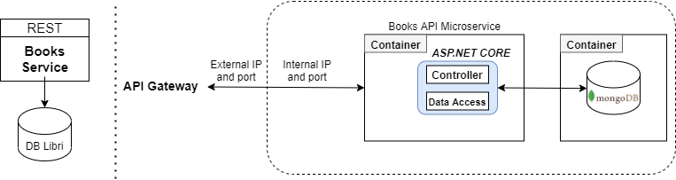

# Book Service

### Map components

**Business requirement:**  Manage books

**Functional:**  Get, add, update, remove

**Data entities:** Books

**Data autonomy:** None

### Technologies

* Docker
* ASP.NET Core 5.0 Web API (with Entity Framework)
* SQL Server 2019
* Swagger Open API 3.0 (JSON schema at <https://localhost:1818/swagger/v1/swagger.json> or https://localhost:1819/swagger/v1/swagger.json>)
