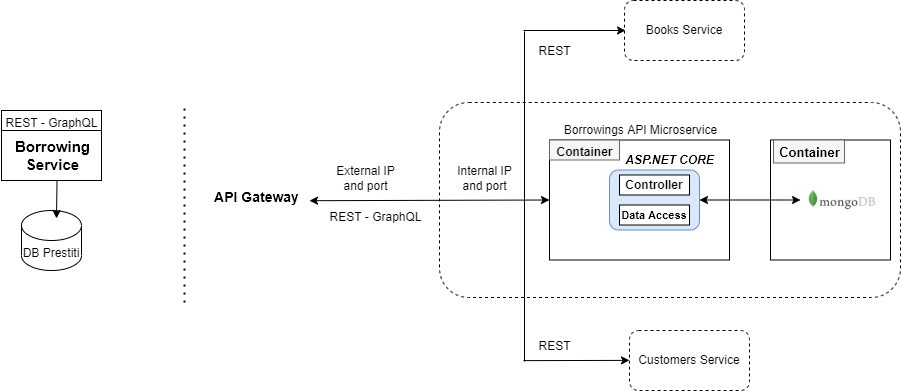

# Borrowings Service

### Map components

**Business requirement:**  Manage Borrowing

**Functional:**  Get, add, update, remove

**Data entities:** Borrowings

**Data autonomy:** Related with Customer Entities and Book Entities

### Technologies

* Docker
* ASP.NET Core 6.0 Web API (with Entity Framework)
* MongoDB
* Swagger Open API 3.0 (JSON schema at)
